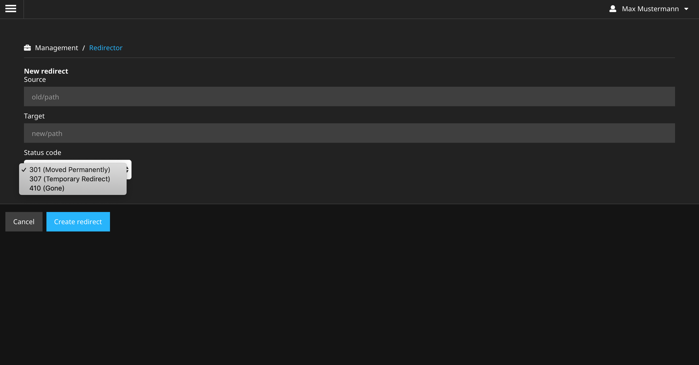

[](https://travis-ci.com/yeebase/Yeebase.Redirector)

# Yeebase.Redirector

Package to view and manage all redirects in the Neos backend. You can create redirects with status 301, 307 and 410.

## Usage

Simply install the package via composer:

```composer require yeebase/redirector```

After that the following overview can be called in the Neos backend under "Redirector" (or alternatively `/neos/management/redirector`):


All redirects created with the standard `RedirectStorage` of Neos are displayed.

New redirects can be created with 301, 307 and 410:

